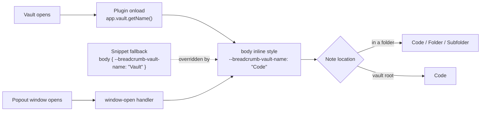

The Obsidian header shows a compact breadcrumb that starts with the vault's name, such as `Code / Projects / Specs`, in place of the note title. Two parts work together: a CSS snippet that restyles the header, and a small local plugin that reads the vault name.

> [!info] Related
> Installation and day-to-day use are covered in [[Vault Name Breadcrumb - User Guide]].

## Overview

**Problem.** By default, Obsidian's header shows the folder path and the note title, and the path starts at the top-level folder, without the vault name. When several vaults are open, nothing in the header says which vault a note belongs to. For notes at the vault root, the header has no path at all.

**Goals**

- Hide the note title in the header and show the folder path as a single styled breadcrumb.
- Start the breadcrumb with the vault name.
- Show the vault name for notes at the vault root too.
- Use identical files in every vault, with no per-vault editing.

**Non-goals**

- Making the vault-name crumb clickable or navigable.
- Changing Obsidian's own folder links in the breadcrumb.
- Publishing the plugin to the Obsidian community plugin store.

## Architecture

The plugin supplies the vault name as data. The snippet does all of the styling. The only link between them is one CSS variable, `--breadcrumb-vault-name`.



| Component | Location in a vault | Responsibility |
| --- | --- | --- |
| CSS snippet | `.obsidian/snippets/reformat-breadcrumb.css` | Hides the title, styles the breadcrumb, adds the vault name in front of it, handles root notes |
| Plugin | `.obsidian/plugins/vault-name-breadcrumb/` | Sets `--breadcrumb-vault-name` to the vault name in every window |

If the plugin is off, the snippet still works and shows the fallback name "Vault".

## CSS snippet design

`reformat-breadcrumb.css` handles all of the visual work. It reads the vault name from the `--breadcrumb-vault-name` CSS variable and never needs editing per vault.

| Rule | Selector | What it does |
| --- | --- | --- |
| 0 | `body` | Sets the fallback `--breadcrumb-vault-name: "Vault"`. The plugin's value overrides it. |
| 1 | `.view-header-title` | Hides the note title (`display: none`). |
| 2 | `.view-header-title-parent` | Styles the folder path as one box: accent text, 600 weight, secondary background, 1px border, 4px radius, 3px × 8px padding. |
| 2a | `.view-header-title-parent::before` | Puts the vault name and a ` / ` separator in front of the folder path. `white-space: pre` keeps the spaces around the slash. |
| 2b | `.view-header-title-parent:empty` and `:empty::before` | For root notes, Obsidian leaves the path element empty and hides it. This rule forces it visible (`inline-flex`) and shows the vault name without a separator. |
| 2c | `.view-header-title-container:not(:has(.view-header-title-parent))::before` | Fallback in case Obsidian leaves the path element out entirely: draws the vault name on the header container, styled the same way as rule 2. |
| 2d | `.view-header-title-parent` | Lays the path out as `inline-flex` with `align-items: baseline`, so the vault name lines up with the folder links. Without it, on Obsidian versions that render the links as padded flex items (seen on macOS), the vault name sits higher than the folders. |
| 3 | `.view-header-title-container` | Lines the header content up on the left with flexbox. |

Rules 2b and 2c never apply at the same time: one needs the path element to exist, the other needs it to be missing. That way the vault name can't appear twice.

The layout and text properties are marked `!important` so they take priority over the header styles from Obsidian and the active theme.

## Plugin design

The **Vault Name Breadcrumb** plugin (`vault-name-breadcrumb`) is about 25 lines of plain JavaScript. It needs no build step and has no settings. Its only job is to set one CSS variable.

**Lifecycle**

1. **`onload`**: calls `app.vault.getName()`, which returns the vault folder's name. It then sets `--breadcrumb-vault-name` as an inline style on `document.body`. Inline styles take priority over the snippet's `body` fallback, so the real name wins.
2. **`window-open` event**: notes popped out into separate windows have their own `document`, so the plugin sets the same variable on each new window's `body`. It registers this with `registerEvent`, so Obsidian removes the listener when the plugin unloads.
3. **`onunload`**: removes the variable from the main window and from every window that has an open note. The breadcrumb then falls back to "Vault".

**Formatting the value.** The name is passed through `JSON.stringify` before it's set. CSS `content` needs a quoted string, and this adds the quotes and escapes any quotes or backslashes in a vault name.

**Manifest.** `manifest.json` declares id `vault-name-breadcrumb`, version 1.0.0, `minAppVersion` 1.0.0 and `isDesktopOnly: false`. The plugin uses only the core Obsidian API, so it should also run on mobile. That hasn't been tested.

## Design decisions and alternatives

A plugin was the only option that is fully automatic. CSS can't read the vault name, because Obsidian never puts it anywhere a stylesheet can see.

| Option | How the name gets in | Per-vault work | Outcome |
| --- | --- | --- | --- |
| Hard-coded name in the snippet | Typed into the CSS variable | Edit every copy, and again after a rename | Used in the first version; replaced |
| PowerShell script that writes the snippet | The script fills in each vault's folder name | Rerun after adding or renaming a vault | Not built |
| Local plugin and a CSS variable | `app.vault.getName()` when the vault opens | Copy the files once and turn them on | **Chosen** |

- **CSS variable, not plugin-injected styles.** The plugin sets a value and the snippet does all the styling. You can change the look without touching JavaScript, and the snippet still works with the fallback name if the plugin is off.
- **Visible fallback name.** The fallback is the generic "Vault" rather than a real vault's name. If you see "Vault", the plugin isn't running.
- **Pseudo-element, not a real link.** The vault name is drawn with `::before`, so it can't be clicked. A clickable crumb would mean the plugin edits Obsidian's header markup, which is more likely to break when Obsidian updates.

## Limitations, risks and future enhancements

**Limitations**

- The vault-name crumb is not clickable, and you can't select or copy its text.
- A renamed vault shows its new name only after Obsidian reopens it. That happens anyway, since Obsidian restarts the vault on rename.
- The plugin must be turned on in each vault, and community plugins must be allowed (restricted mode off).
- Mobile behavior is untested.

**Risks**

- **Obsidian markup changes.** The snippet depends on Obsidian's internal class names (`view-header-title`, `view-header-title-parent`, `view-header-title-container`). If an Obsidian update renames them, the breadcrumb falls back to Obsidian's default header. The vault notes themselves are not affected.
- **Theme conflicts.** A theme that restyles the header could override parts of the look. The `!important` flags reduce this risk but can't rule it out.
- **Behavior for root notes.** Rules 2b and 2c rely on how Obsidian renders the header for notes at the vault root. The full setup was confirmed working in Obsidian on 2026-10-05.

**Possible enhancements**

- A settings tab for a custom display name or separator.
- A clickable vault crumb that opens the file explorer at the vault root.
- A script that copies the plugin and snippet into every vault in a parent folder.

## File inventory

| File | Purpose |
| --- | --- |
| `reformat-breadcrumb.css` | Source of the CSS snippet |
| `vault-name-breadcrumb/main.js` | Source of the plugin |
| `vault-name-breadcrumb/manifest.json` | Plugin manifest |
| `<vault>/.obsidian/snippets/reformat-breadcrumb.css` | Installed copy in each vault |
| `<vault>/.obsidian/plugins/vault-name-breadcrumb/` | Installed copy in each vault |

## Source listing

### reformat-breadcrumb.css

```css
/* 0. Vault name shown as the root of the breadcrumb.
      The vault-name-breadcrumb plugin sets this automatically from the vault folder name;
      the value below is only a fallback for when the plugin is not running.
*/
body {
    --breadcrumb-vault-name: "Vault";
}

/* 1. Hide the file title entirely from the header bar */
.view-header-title {
    display: none !important;
}

/* 2. Style the parent folder path and ensure it anchors cleanly.
      The second selector is a stand-in crumb used when Obsidian omits the parent element (root notes). */
.view-header-title-parent,
.view-header-title-container:not(:has(.view-header-title-parent))::before {
    font-size: 01.01rem !important;
    font-weight: 600 !important;
    color: var(--text-accent) !important;
    background-color: var(--background-secondary);
    padding: 3px 8px;
    border-radius: 4px;
    border: 1px solid var(--border-color);
    
    /* Ensure no remaining margins push it out of alignment */
    margin: 0 !important; 
}

/* 2a. Prepend the vault name as the root crumb, followed by a separator */
.view-header-title-parent::before {
    content: var(--breadcrumb-vault-name) " / ";
    white-space: pre;
}

/* 2b. Notes at the vault root have no parent folders: Obsidian leaves the element empty and hides it,
       so force it visible and show the vault name alone */
.view-header-title-parent:empty {
    display: inline-flex !important;
}

/* 2d. Some Obsidian versions lay the folder links out as flex items with their own padding,
       which leaves the vault name riding high. Align everything on the text baseline instead. */
.view-header-title-parent {
    display: inline-flex;
    align-items: baseline !important;
}

.view-header-title-parent:empty::before {
    content: var(--breadcrumb-vault-name);
}

/* 2c. Fallback if Obsidian removes the parent element entirely for root notes */
.view-header-title-container:not(:has(.view-header-title-parent))::before {
    content: var(--breadcrumb-vault-name);
}

/* 3. Force the parent container to align perfectly left */
.view-header-title-container {
    justify-content: flex-start !important;
    text-align: left !important;
    align-items: center !important;
    display: flex !important;
}
```

### vault-name-breadcrumb/main.js

```js
const { Plugin } = require('obsidian');

// Publishes the vault name (= vault folder name) as a CSS variable so the
// reformat-breadcrumb snippet can show it as the root crumb without hardcoding it.
const VAR_NAME = '--breadcrumb-vault-name';

module.exports = class VaultNameBreadcrumb extends Plugin {
    onload() {
        this.setVar(document);

        // Popout windows have their own document, so set the variable there too
        this.registerEvent(this.app.workspace.on('window-open', (win) => this.setVar(win.doc)));
    }

    onunload() {
        document.body.style.removeProperty(VAR_NAME);
        this.app.workspace.iterateAllLeaves((leaf) => {
            leaf.view.containerEl.doc.body.style.removeProperty(VAR_NAME);
        });
    }

    setVar(doc) {
        // JSON.stringify yields a quoted, escaped string, which is what CSS `content` needs
        doc.body.style.setProperty(VAR_NAME, JSON.stringify(this.app.vault.getName()));
    }
};
```

### vault-name-breadcrumb/manifest.json

```json
{
  "id": "vault-name-breadcrumb",
  "name": "Vault Name Breadcrumb",
  "version": "1.0.0",
  "minAppVersion": "1.0.0",
  "description": "Exposes the vault name as the --breadcrumb-vault-name CSS variable for the reformat-breadcrumb snippet.",
  "author": "donavaughn",
  "isDesktopOnly": false
}
```
